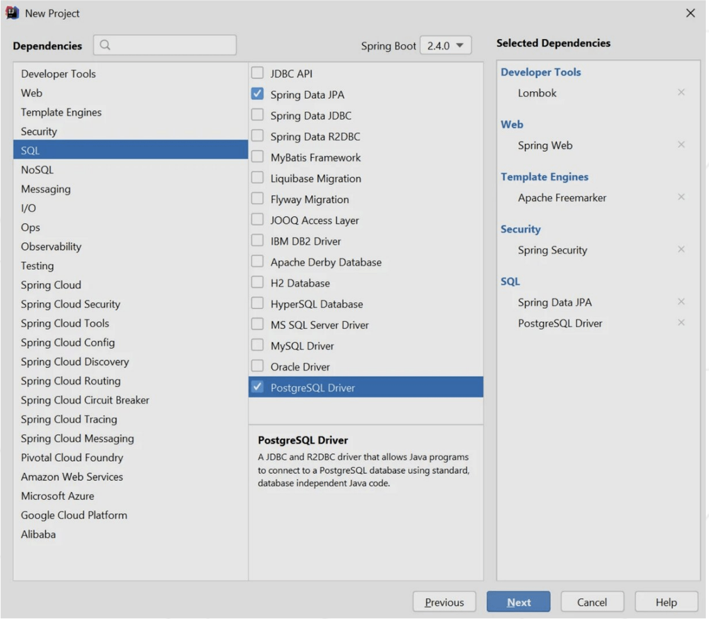
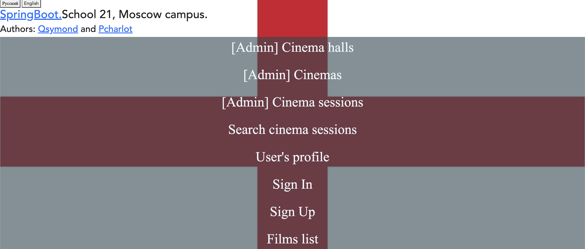
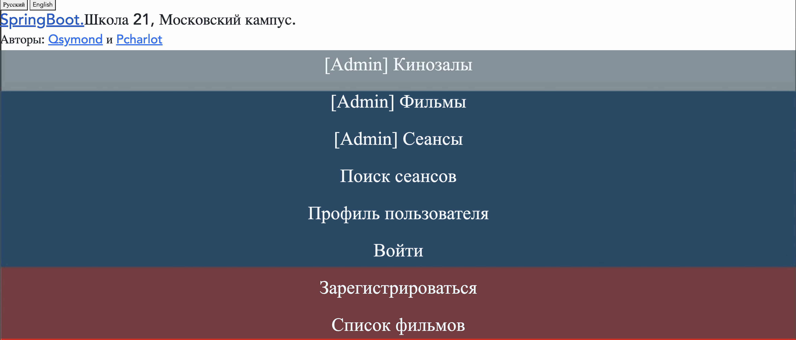

Проект SpringBoot. Школа 21. Московский кампус.
========================
Выполнен: Qsymond, Tfarenga.
-------------------------
---
Используемые инструменты:

В рамках 1-го задания:  
Для работы с базой данных использован JpaRepository, сделано разграничение доступа  
пользователей на основе Spring Security (использованы стандартные интерфейсы  
UserDetails, UserDetailsService). Сделаны кастомные страницы регистрации и авторизации. 
Встроен функционал Remebmer-me. Сделана защита от csrf атак. Роли пользователей хранятся в Enum. 
В рамках 2-го задания:  
Реализована поддержка двух языков (английский, русский).  
Реализована кастомная валидация введенных данных.  
В рамках 3-го задания:  
Реализовано подтверждение аккаунта через электронную почту. 
Скрины работы:
 
 
Запуск: mvn spring-boot:run
